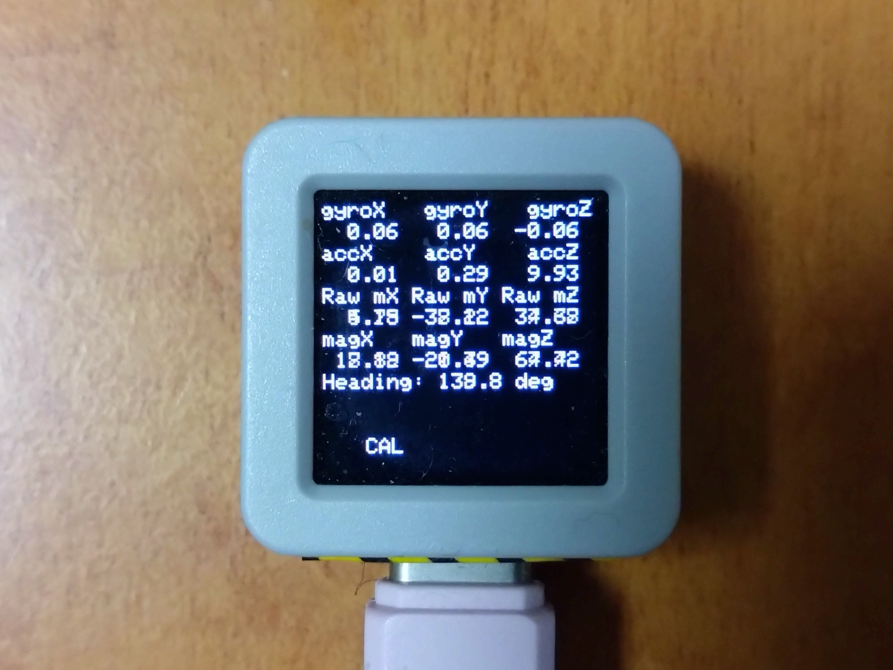
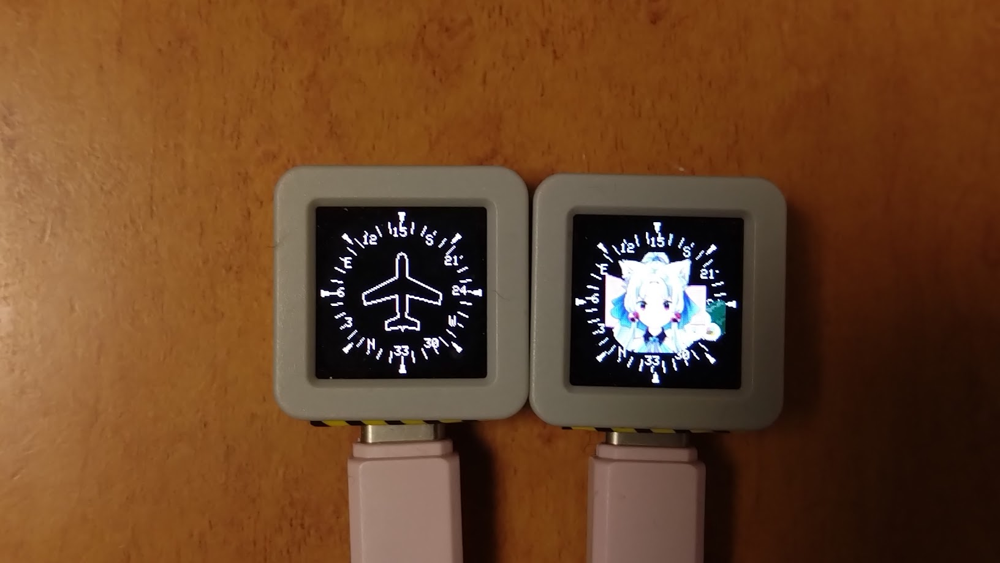
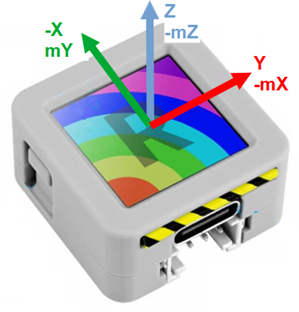

# M5ATOMS3R IMU Examples

## Do not use this unit in situations involving safety to life.

9DoF test  
  

3D compass  
hsi_S and ehou2025_S  
  

Orientation  

- BMI270 I2C address = 0x68  
- Tohoku elder sister is not included.

## PlatformIO only (not worked Arduino-IDE)
Copy example code to src folder and rename main.cpp

- Modifed bmm150_defs.h using floating point
~~~
/******************************************************************************/
/*! @name        Compiler switch macros Definitions                */
/******************************************************************************/
#define BMM150_USE_FLOATING_POINT //OK

#ifndef BMM150_USE_FLOATING_POINT /*< Check if floating point (using BMM150_USE_FLOATING_POINT) is enabled */
#ifndef BMM150_USE_FIXED_POINT /*< If floating point is not enabled then enable BMM150_USE_FIXED_POINT */
#define BMM150_USE_FIXED_POINT
#endif
#endif
~~~

## Serial Monitor
To keep the display speed, use M5.Log.Printf instead of Serial or USBSerial

## Caribration
Press BTN-A(display). And flip random direction.

## References
https://github.com/boschsensortec/BMI270_SensorDriver  
https://github.com/boschsensortec/BMM150_SensorDriver  
https://github.com/m5stack/M5Unified  
https://x-io.co.uk/open-source-imu-and-ahrs-algorithms/  
picture data converter: https://lang-ship.com/blog/

## License
- 9PEO0xNd - MIT
- M5Unified - MIT by M5Stack
- BMI270 BSD-3-Clause license by BoschSensortec
- BMM150 BSD-3-Clause license by BoschSensortec

## History
2025/Jan/31 Initial release
